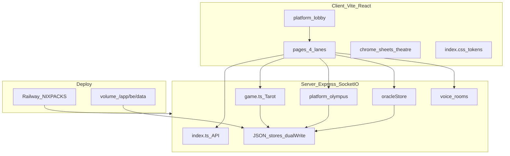

# Studying — Kiến trúc & Design System

> **Cấu trúc code app:** `be/` (backend) · `fe/` (frontend) · `studying/` (học tập) · `local/` (lab/tool máy bạn).

**Cập nhật: 12/08/2026 · Version studying: [4 — multi-lane-theatre](./versions/v4/) · App freeze COMS 4090: [com409/version--SOFIA409/](./com409/version--SOFIA409/)**

Bộ tài liệu tham chiếu khi phát triển tính năng cho **SOFIAORE-TAROT** (monorepo Vite + React + Express + Socket.io). Đọc theo thứ tự lần đầu; sau đó dùng bảng tra cứu nhanh bên dưới.

> **Version 4 (ưu tiên nếu học full dự án):** [`26-deep-weave-v4.md`](./26-deep-weave-v4.md) — đan xen lane × identity × store × UI + Track E. Snapshot: [`versions/v4/`](./versions/v4/).  
> **Plan đẹp (ưu tiên đọc epic):** [`plans/cursor/*.plan.md`](./plans/cursor/) — YAML + todos + mermaid như Cursor Plan. Mục lục: [plans/index.md](./plans/index.md).  
> **Học pattern & sự cố:** [18-learning-path.md](./18-learning-path.md) → [15-design-patterns-atlas.md](./15-design-patterns-atlas.md) → nhật ký phiên → [17-problems-solutions-catalog.md](./17-problems-solutions-catalog.md).  
> **Deploy GitHub → Railway (bắt buộc đọc trước khi ship):** [14-git-railway-deploy.md](./14-git-railway-deploy.md).  
> **Slot 5×3 / Cyber Fortune vs SOFIAORE:** [20-cyber-fortune-vs-sofiaore.md](./20-cyber-fortune-vs-sofiaore.md).

## Mục lục

| # | Tài liệu | Nội dung |
|---|----------|----------|
| 1 | [01-monorepo-deploy.md](./01-monorepo-deploy.md) | Workspaces, scripts, Railway, env, volume data |
| 2 | [02-design-system.md](./02-design-system.md) | Tokens, typography, principles, state matrix |
| 3 | [03-frontend-routing.md](./03-frontend-routing.md) | Routes, guards, pages, auth/guest |
| 4 | [04-backend-api-socket.md](./04-backend-api-socket.md) | REST, Socket.io, GameEngine |
| 5 | [05-data-persistence.md](./05-data-persistence.md) | JSON stores, backup, kiểm tra prod |
| 6 | [06-feature-playbook.md](./06-feature-playbook.md) | Checklist thêm tính năng end-to-end |
| 7 | [07-ui-pattern-catalog.md](./07-ui-pattern-catalog.md) | **Sơ đồ pattern, anatomy, page composition** |
| 14 | [14-git-railway-deploy.md](./14-git-railway-deploy.md) | **Toàn bộ bước + cách deploy** (push, redeploy, `up`, verify) |
| 15 | [15-design-patterns-atlas.md](./15-design-patterns-atlas.md) | **Atlas pattern** (Repository, Orphan, Strategy, Guard, …) |
| 16 | [16-session-log-2026-07-20.md](./16-session-log-2026-07-20.md) | Nhật ký xử lý phiên 20/07 |
| 17 | [17-problems-solutions-catalog.md](./17-problems-solutions-catalog.md) | **Catalog P-001…** triệu chứng ↔ fix |
| 18 | [18-learning-path.md](./18-learning-path.md) | Lộ trình học A–E + bài tập |
| 19 | [19-session-log-2026-07-21.md](./19-session-log-2026-07-21.md) | **Nhật ký 21/07** (tutien/voice/mod + deploy webhook chết) |
| 20 | [20-cyber-fortune-vs-sofiaore.md](./20-cyber-fortune-vs-sofiaore.md) | **Cyber Fortune (Slot 5×3) vs SOFIAORE** — gap, attention, checklist A/B |
| 21 | [21-voice-room-persist-grants.md](./21-voice-room-persist-grants.md) | **Voice giữ ghế khi đổi bàn** + cấp Room# đóng/MK |
| 22 | [22-inter-live-observe.md](./22-inter-live-observe.md) | **Inter quan sát live** + softuser/vaultguard/crowdcap |
| 23 | [23-safe-feature-upgrade.md](./23-safe-feature-upgrade.md) | **Nâng cấp an toàn** — không rung gameplay/kho |
| 24 | [24-grants-and-roles.md](./24-grants-and-roles.md) | **Grant ladder L0–L6** + role **eco/audit** + capability |
| 25 | [25-tarot-gem-table.md](./25-tarot-gem-table.md) | **Tarot Gem (deferred)** — bàn #2 + gemBalance; chưa ship |
| **26** | [**26-deep-weave-v4.md**](./26-deep-weave-v4.md) | **Version 4 — đan xen full dự án** (lane × identity × store × UI) |

Đọc UI trực quan: **[07-ui-pattern-catalog.md](./07-ui-pattern-catalog.md)** (anatomy BottomSheet, GamePage, Admin, Arcana).

### Versions (local snapshot — không push)

| Ver | Codename | Folder |
|-----|----------|--------|
| 3 | feedback-noti-jackpot | [versions/v3/](./versions/v3/) |
| **4** | **multi-lane-theatre** | [**versions/v4/**](./versions/v4/) |
| **SOFIA409** | **coms409-baseline** | [**com409/version--SOFIA409/**](./com409/version--SOFIA409/) — disk `tree/` + nhánh git local |

### Plans (định dạng Cursor `.plan.md`)

| | |
|--|--|
| Mục lục | [plans/index.md](./plans/index.md) |
| Full plans | [plans/cursor/](./plans/cursor/) — harden, voice, Inter live, Arcana, Railway… |
| Digest cũ | [plans/archive/](./plans/archive/) |
| Changelog | [plans/changelog-by-feature.md](./plans/changelog-by-feature.md) |

### Tài liệu bổ sung (legacy / chuyên đề)

| File | Ghi chú |
|------|---------|
| [2026-07-20-arcana-wheel-rtp-audit.md](./2026-07-20-arcana-wheel-rtp-audit.md) | RTP Arcana |
| [2026-07-20-avatar-profile-deploy.md](./2026-07-20-avatar-profile-deploy.md) | Avatar / profile |

## Sơ đồ tổng quan (v4 — multi-lane)

## Tra cứu nhanh — muốn sửa gì, mở file nào

| Mục tiêu | File / thư mục |
|----------|----------------|
| **Học full dự án / Version 4** | [26-deep-weave-v4.md](./26-deep-weave-v4.md) |
| **Ship lên web / Railway kẹt** | [14-git-railway-deploy.md](./14-git-railway-deploy.md) |
| **Slot 5×3 / weighted RNG / RTP / Cyber Fortune** | [20-cyber-fortune-vs-sofiaore.md](./20-cyber-fortune-vs-sofiaore.md) |
| **Bói Theatre / sổ / khẩu quyết** | [BoiBaiPage.tsx](../fe/src/pages/BoiBaiPage.tsx), [oracleDeck.ts](../fe/src/oracleDeck.ts), [oracleMantras.ts](../fe/src/oracleMantras.ts) |
| **Olympus / P+M FX** | [BoltPeakPage.tsx](../fe/src/pages/BoltPeakPage.tsx), [PmAssetsPanel.tsx](../fe/src/components/PmAssetsPanel.tsx) |
| Màu, nút, sheet, font | [fe/src/index.css](../fe/src/index.css) |
| Pattern / sơ đồ UI | [studying/07-ui-pattern-catalog.md](./07-ui-pattern-catalog.md) |
| Route URL, guard role/mã user | [fe/src/App.tsx](../fe/src/App.tsx) |
| Login, token, `homePath` / `playPath` | [fe/src/auth.ts](../fe/src/auth.ts) |
| Khách / mã guest | [fe/src/guest.ts](../fe/src/guest.ts) |
| Bàn chơi realtime (Socket) | [fe/src/pages/GamePage.tsx](../fe/src/pages/GamePage.tsx) |
| Admin panel / Room / Inter | [fe/src/pages/AdminDashboard.tsx](../fe/src/pages/AdminDashboard.tsx) |
| Voice rooms | [fe/src/voice/](../fe/src/voice/), [VoiceRoomHub.tsx](../fe/src/components/VoiceRoomHub.tsx) |
| Ảnh UI, lá bài, manifest | [fe/public/assets/](../fe/public/assets/), [manifest.json](../fe/public/assets/manifest.json) |
| REST API, Socket handlers | [be/src/index.ts](../be/src/index.ts) |
| Vòng cược, phase, bot | [be/src/game.ts](../be/src/game.ts) |
| Kiểu `PublicState`, phase | [be/src/types.ts](../be/src/types.ts) |
| User / token JSON | [be/src/auth.ts](../be/src/auth.ts) |
| Data local / prod | [be/data/](../be/data/) (gitignore — không lên GitHub) |
| Deploy Railway | [railway.toml](../railway.toml), [README.md](../README.md) |
| Backup data | `npm run backup:data` → [be/scripts/backup-data.mjs](../be/scripts/backup-data.mjs) |

## Khi bắt đầu feature mới

1. Đọc [06-feature-playbook.md](./06-feature-playbook.md) (+ [26](./26-deep-weave-v4.md) §9 bó file).
2. Xác định role (user / admin / mainadmin / guest) → [03-frontend-routing.md](./03-frontend-routing.md).
3. REST hay Socket → [04-backend-api-socket.md](./04-backend-api-socket.md).
4. UI theo design system → [02-design-system.md](./02-design-system.md) + pattern [07-ui-pattern-catalog.md](./07-ui-pattern-catalog.md).
